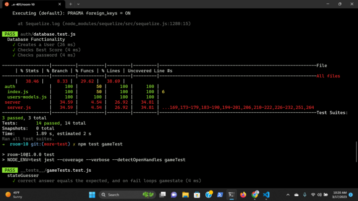
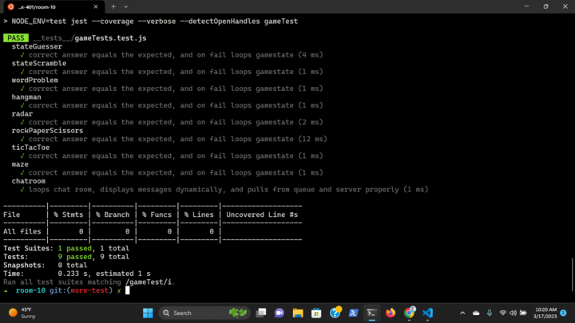
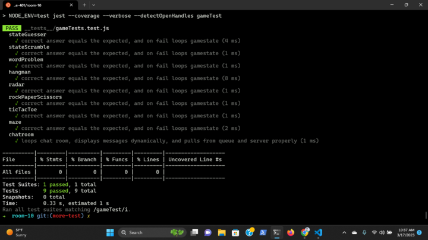

# Room-10

## Project: Room-10 Multiplayer Game

### Author: Tyler Bennett, Jordan Covington, Ty Aponte, Yen Xiong Yuan

### Problem Domain  

A game that can be played completely in the CLI leveraging WebSocket to enable mulitplayer.

### Links and Resources

- [Link to Small Demo](https://codesandbox.io/p/github/Ty-Ap/Room10/main?layout=%257B%2522sidebarPanel%2522%253A%2522EXPLORER%2522%252C%2522gitSidebarPanel%2522%253A%2522COMMIT%2522%252C%2522rootPanelGroup%2522%253A%257B%2522direction%2522%253A%2522horizontal%2522%252C%2522type%2522%253A%2522PANEL_GROUP%2522%252C%2522id%2522%253A%2522ROOT_LAYOUT%2522%252C%2522panels%2522%253A%255B%257B%2522type%2522%253A%2522PANEL_GROUP%2522%252C%2522direction%2522%253A%2522vertical%2522%252C%2522id%2522%253A%2522EDITOR%2522%252C%2522panels%2522%253A%255B%257B%2522type%2522%253A%2522PANEL%2522%252C%2522panelType%2522%253A%2522TABS%2522%252C%2522id%2522%253A%2522clhfekdfr0009356kxydkpgfe%2522%257D%255D%252C%2522sizes%2522%253A%255B100%255D%257D%252C%257B%2522type%2522%253A%2522PANEL_GROUP%2522%252C%2522direction%2522%253A%2522vertical%2522%252C%2522id%2522%253A%2522DEVTOOLS%2522%252C%2522panels%2522%253A%255B%257B%2522type%2522%253A%2522PANEL%2522%252C%2522panelType%2522%253A%2522TABS%2522%252C%2522id%2522%253A%2522clhfekdfr000b356kjvpxe9cy%2522%257D%255D%252C%2522sizes%2522%253A%255B100%255D%257D%255D%252C%2522sizes%2522%253A%255B50%252C50%255D%257D%252C%2522tabbedPanels%2522%253A%257B%2522clhfekdfr0009356kxydkpgfe%2522%253A%257B%2522tabs%2522%253A%255B%257B%2522id%2522%253A%2522clhfekdfr0008356kubjaj82x%2522%252C%2522mode%2522%253A%2522permanent%2522%252C%2522type%2522%253A%2522FILE%2522%252C%2522filepath%2522%253A%2522%252FREADME.md%2522%257D%255D%252C%2522id%2522%253A%2522clhfekdfr0009356kxydkpgfe%2522%252C%2522activeTabId%2522%253A%2522clhfekdfr0008356kubjaj82x%2522%257D%252C%2522clhfekdfr000b356kjvpxe9cy%2522%253A%257B%2522tabs%2522%253A%255B%257B%2522id%2522%253A%2522clhfekdfr000a356k45cv2odk%2522%252C%2522mode%2522%253A%2522permanent%2522%252C%2522type%2522%253A%2522TASK_LOG%2522%252C%2522taskId%2522%253A%2522start%2522%257D%255D%252C%2522id%2522%253A%2522clhfekdfr000b356kjvpxe9cy%2522%252C%2522activeTabId%2522%253A%2522clhfekdfr000a356k45cv2odk%2522%257D%257D%252C%2522showDevtools%2522%253Atrue%252C%2522showSidebar%2522%253Atrue%252C%2522sidebarPanelSize%2522%253A15%257D)

- [Link to Repository](https://github.com/Team-Room-10/room-10/)

- [ci/cd](https://github.com/Team-Room-10/room-10/actions/new)

- [Project Management Board](https://trello.com/b/KYO7ODfy/development-for-room-10)

- [Deployed Server](https://room-10-practice.onrender.com/)

### Setup

#### How to initialize/run your application (where applicable)

- In terminal type the following:
  - npm i
  - npm start  

#### Features / Routes

- Login Screen
  - Login with Basic Auth
  - Create a new User
  - Sign in as Guest
- Game 1 - Memorization
- Game 2 - Word Scramble
- Game 3 - Word Problem
- Game 4 - Hangman
- Game 5 - Radar Pain
- Game 6 - Blackjack
- Game 7 - Rock, Paper, and Scissors
- Game 8 - Tic Tac Toe
- Game 9 - Maze of Doom
- Game 10 - Chat Room/Leaderboard

#### Tests

#### UML

#### Database Schema

