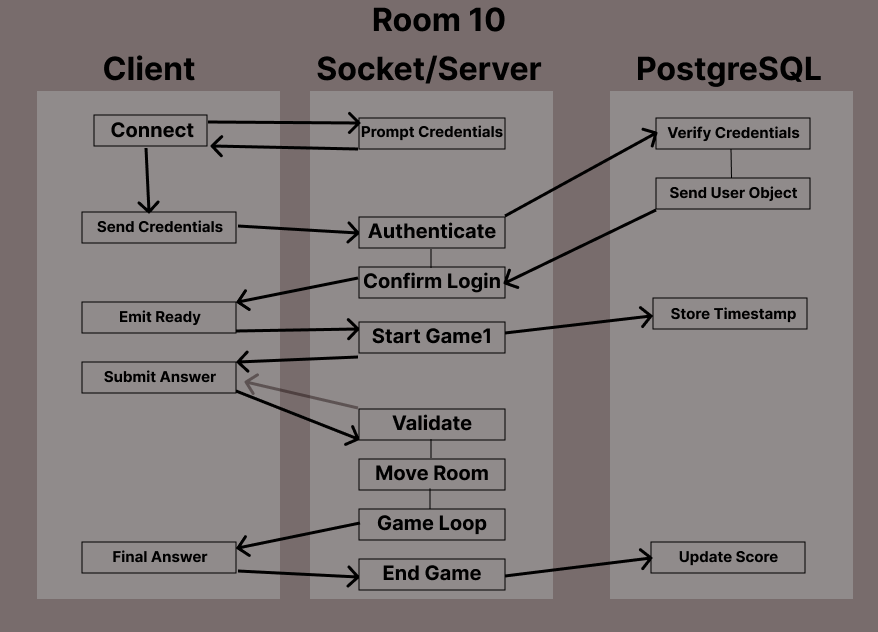
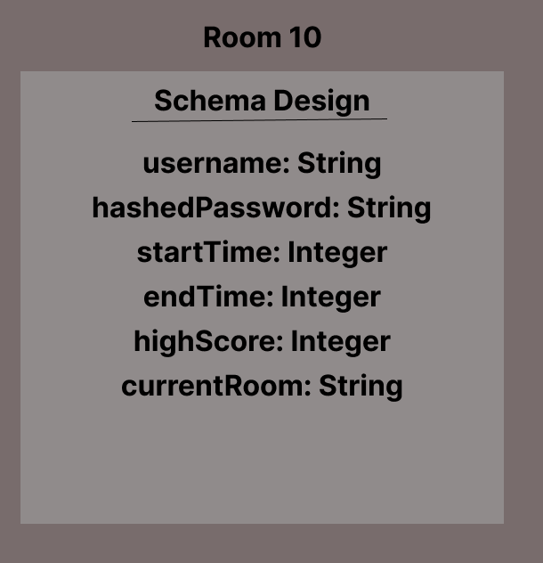

# room-10

## Project: Room-10 Multiplayer Game

### Author: Tyler Bennett, Jordan Covington, Ty Aponte, Yen Xiong Yuan

### Problem Domain  

A game that can be played completely in the CLI leveraging WebSocket to enable mulitplayer.

### Links and Resources

- [ci/cd](https://github.com/Team-Room-10/room-10/actions/new)
<!-- - [back-end server deployed]() -->
- [Project Management Board](https://trello.com/b/KYO7ODfy/development-for-room-10)

### Setup

#### `.env` requirements (where applicable)

#### How to initialize/run your application (where applicable)

- run npm i in command line
- cd into server > nodemon server.js into command line
- cd into clients > type node 'player.js' into command line

#### Features / Routes

#### Tests

- How do you run tests? npm test

#### UML

#### Database Schema

